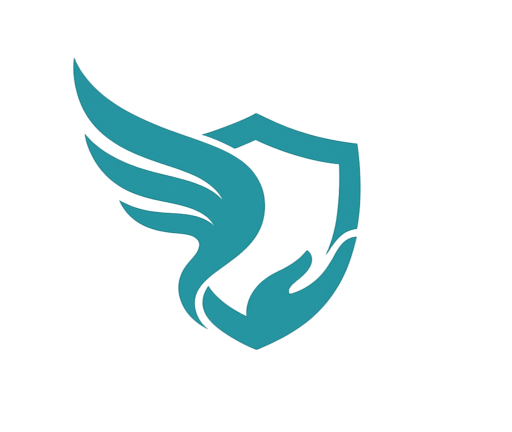

# Carepilot

## 📂 프로젝트 소개

AI 자동 통화를 통해 케어 대상자의 상태를 수집하고
위험 신호를 분석·감지하는 지능형 케어 모니터링 플랫폼

## 🔹기획 배경

### 1. 케어 수요의 구조적 증가

고령 인구 및 케어 대상자 급증: 인구 구조 변화로 인해 돌봄이 필요한 대상자가 지속적으로 증가하고 있습니다.

관리 방식의 한계: 기존의 인력 중심 수동 관리 방식으로는 늘어나는 수요를 감당하기에 물리적 한계에 봉착했습니다.

### 2. 전화 기반 케어 운영의 한계

운영 효율 저하: 현재 의료기관의 케어 운영은 여전히 전화 통화에 의존하고 있어 업무 부하가 높습니다.

확장성 제한: 모니터링 인원 증가 시 비례하여 운영 리소스가 급증하므로 대규모 대상자 관리가 어렵습니다.

### 3. 비정형 데이터 중심 관리 구조

데이터 활용 부재: 중요한 케어 정보가 포함된 통화 내용이 단순 음성 데이터(비정형) 상태로 방치되고 있습니다.

위험 감지 지연: 누적된 데이터를 정량적으로 분석하기 어려워, 케어 대상자의 위험 신호(Risk Sign)를 사전에 포착하거나 체계적으로 대응하는 데 제약이 있습니다.

## 📂개발 기간

**2026.01.21(수) — 2026.02.23(월)** (총 34일)

## 📂팀원

| <a href="https://github.com/junhwan0427"><br /><b>조준환</b><br />팀장</a> | <a href="https://github.com/jwantit"><br /><b>김지원</b><br />팀원</a> | <a href="https://github.com/JeonHaSung"><br /><b>전하성</b><br />팀원</a> | <a href="https://github.com/leegh063"><br /><b>이건호</b><br />팀원</a> |
| :---------------------------------------------------------------------------------------------------------------------------------------------: | :-------------------------------------------------------------------------------------------------------------------------------------: | :-------------------------------------------------------------------------------------------------------------------------------------------: | :---------------------------------------------------------------------------------------------------------------------------------------: |

### 📝조준환 (팀장)

**[Front-end]**

- Redux Toolkit 기반 전역 상태 관리 및 사용자 인증(Auth) 흐름 구축
- Tailwind CSS를 활용한 전체 스타일링 및 다크/라이트 모드 테마 시스템 구현
- 채팅 인터페이스 기반의 SMS 위젯(UI) 개발
- 알림 설정 프론트 연동

**[Back-end]**

- Spring Security + JWT 기반 보안 인증 체계 구축
- Redis 기반 토큰 관리 및 보안 강화
- 조직 기반 데이터 필터링 및 접근 제어
- 카카오 OAuth2 소셜 로그인 및 회원가입 로직
- SMTP 기반 메일 인증 및 승인 알림
- Twilio API 연동 SMS/MMS 수발신 로직 구현
- 폴링(Polling) + 워커(Worker) 기반 통화 스케줄러
- 시그널 기반 위험도 점수 산정 로직

**[Server AI (Spring AI)]**

- LLM Vision을 활용한 처방전 AI OCR
- 통화 기록 자동 요약 시스템

### 📝김지원 (팀원)

**[Front-end]**

- React Router v6 기반 SPA 구조 설계 및 모듈화
- React.lazy/Suspense 활용 라우트 단위 코드 스플리팅
- react-virtualized 기반 대용량 리스트 무한스크롤
- Chart.js 활용 통화 통계 및 위험도 추이 시각화
- Toast 공용 알림 컴포넌트 제작 및 전역 상태 연동
- 시나리오/의료진/위험도 관리 등 설정 UI 구현
- 통화 이력 및 스케줄 등록/관리 페이지 구현

**[Back-end]**

- Twilio API 기반 자동 전화 발신 인프라 구축
- STOMP 프로토콜 기반 WebSocket 실시간 알림 시스템
- Spring Data JPA 기반 통화 이력/스케줄 CRUD 및 조직별 데이터 필터링/접근 제어 로직 구현
- 실시간 긴급 상황 감지 및 의료진 SMS 발송 로직
- 대화 중 감지된 요청사항 시스템 자동 반영 로직
- 통화 녹음 파일 저장 및 스트리밍 데이터 처리
- 통화 상태(성공/실패/무응답) 실시간 동기화

**[Server AI (Spring AI)]**

- OpenAI GPT-4o 활용 실시간 지능형 질문 생성
- Redis VectorStore 연동 RAG 기반 맥락 검색
- 비동기 벡터 인덱싱 처리를 통한 대화 지연 최적화
- 통화 내용 자동 요약 및 핵심 요청사항 추출 파이프라인
- 페르소나 기반 개인화 프롬프트 엔지니어링 수행
- 실시간 대화 데이터 임베딩 및 벡터화 자동화


### 📝이건호 (팀원)

**[Front-end]**

- Multipart(FormData) 기반 게시글 데이터 및 파일 통합 전송 구현
- 재귀 렌더링 아키텍처를 활용한 계층형 대댓글 트리 UI 구축
- 답글 시 부모 댓글 작성자 자동 태깅(@) 및 삭제 댓글 필터링 UX 구현
- 다중 API 병렬 호출(Parallel Fetching)을 통한 대시보드 로딩 처리
- 독립 위젯 기반 컴포넌트 설계 및 상세 페이지 이동을 위한 허브 UI 구현

**[Back-end]**

- 게시물 상단 고정(isPinned) 및 생성일 역순 기반의 복합 정렬 조회 구현
- HashMap 자료구조를 활용한 부모-자식 관계의 댓글 트리 변환 로직 구축
- 이기종 엔티티(통화·작업·알림) 데이터 병합 및 조직별 동적 집계 API 개발
- 게시글 수정/삭제 시나리오에 따른 업로드 파일 생애주기 관리 시스템 구축
- validateWriter 기반 작성자 본인 검증 및 Soft Delete 적용으로 데이터 관리

### 📝전하성 (팀원)

**[Front-end]**

- Redux Toolkit을 활용한 전역 상태 관리
- Chart.js 기반 케어 대상자 위험추이 트렌드 차트 구현
- React-Draggable/Resizable 기반의 자유로운 드래그 및 크기 조절이 가능한 플로팅 채팅창 구현
- 사용자 선택에 따른 Cloud(OpenAI) & On-device(Ollama) 모델 실시간 스위칭 UI 로직 구축
- FormData 기반 이미지 업로드 및 미리보기 인터페이스 구현
- 케어 그룹 및 대상자 목록의 조직별 권한에 따른 조건부 렌더링 시스템 구축
- Tailwind CSS 기반 반응형 UI 구현 (모바일/태블릿/데스크톱 대응)

**[Back-end]**

- Spring Data JPA 기반 케어 대상자/그룹 CRUD 및 조직별 데이터 필터링/접근 제어 로직 구현
- MultipartFile 기반 파일 처리 시스템 및 대용량 데이터 관리를 위한 스토리지 연동
- Apache POI를 활용한 CSV/Excel 파싱 및 벌크 인서트(Bulk Insert)를 통한 대량 등록 성능 최적화
- Querydsl을 활용한 동적 쿼리 처리로 케어 대상자 상세 검색 및 필터링 기능 강화

**[Server AI (Spring AI)]**

- @Qualifier & @Bean을 활용한 다중 LLM(GPT-4o-mini 등) 공급 체계 구축
- Redis Vector Store를 활용한 고성능 벡터 검색 인프라 구축
- 목적별(챗봇용/전화용) Vector Store 분리 운영 전략 수립 및 데이터 격리 구현
- VectorIndexingService를 통한 배치 기반 문서 파싱 및 벡터화(Vectorization) 파이프라인 구축
- ChatMemory 기반 컨텍스트 관리 시스템 구현으로 매끄러운 멀티턴 대화(Multi-turn) 지원
- Spring AI Tools (Function Calling)를 활용하여 DB 데이터를 직접 조회/수정하는 실행형 에이전트 구현
- Prompt Template 구조화 및 동적 프롬프트 생성을 통한 RAG 답변 정확도 최적화

**[On-device AI]**

- Ollama를 활용한 로컬 LLM 환경별 동적 주입 구현
- BGE-M3 임베딩 모델을 결합한 로컬 벡터화 엔진 구축
- 임베딩 모델 직접 연동을 통한 온디바이스 벡터 파이프라인 구축

## 📂주요 기능

- **로그인 및 회원가입** - JWT 인증 및 카카오 소셜 로그인
- **직원 관리** - 가입 승인 및 권한 관리
- **대시보드** - 오늘의 일정, 즉시 조치 필요한 알림, 미처리 업무 현황
- **케어 대상자 관리** - 모니터링할 케어 대상자 CRUD + CSV/EXCEL 대량 등록
- **케어 그룹 관리** - 유사성이 같은 대상자들을 그룹별로 관리하여 모니터링
- **통화** - (그룹/개인) 통화 스케줄 예약 및 자동화
  - Call(STT 음성인식 + Twilio) - 음성인식을 통해 대상자의 상태 확인
  - AI 분석(LLM) - 실시간 긴급상태 감지, 위험도 산정, 통화 요약
- **SMS 서비스** - 양방향 문자 수발신, 인공지능 기반 예약 변경 감지, 처방전 AI OCR
- **통계 및 리포트** - 위험도 추이 및 통화 성공률 분석, PDF 리포트 다운로드
- **작업** - 효율적인 업무 처리를 위한 할일 목록 및 이력 관리
- **실시간 알림** - WebSocket 기반 긴급 상황 실시간 푸시 알림
- **AI 챗봇** - RAG 기반 정보 검색 및 Function Calling 기반 데이터 관리
- **커뮤니티** - 계층형 댓글 구조의 공지사항 및 파일 첨부
- **UX/UI** - 반응형 레이아웃(PC/태블릿/모바일), 다크/라이트 모드 지원

## 📂 사용 스택

🖥️ **Front-end**  


🗄️ **Back-end**  


🤖 **AI/ML**  


🗺️ **API**  


---

## 📂 배포 파이프라인 아키텍처

### AWS Cloud Ecosystem
- **IAM** - 엄격한 권한 관리 및 보안 정책 적용
- **EC2** - 확장 가능한 서버 환경 구축

### Elastic Beanstalk
- 애플리케이션 환경 관리 및 배포 프로세스 표준화
- 자동 스케일링 및 환경 구성 관리

### Database Management
- **RDS(MySQL)** - 데이터 독립성 확보 및 고가용성 제공
- **Security Group** - 네트워크 레벨 접근 제어를 통한 보안 강화

### Nginx Reverse Proxy
- 리버스 프록시 설정을 통한 로드 밸런싱
- 서비스 중단 없는 무중단 배포 환경 구현

### CI/CD Automation
- **Jenkins** - 코드 통합 및 빌드 자동화
- **Elastic Beanstalk 연동** - 코드 통합부터 실행까지 전 과정 자동화


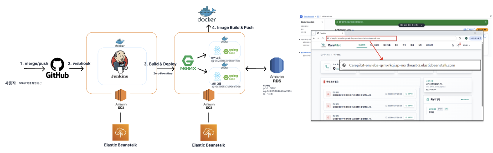
---

## 📂ERD & 유스케이스

### 🔹ERD

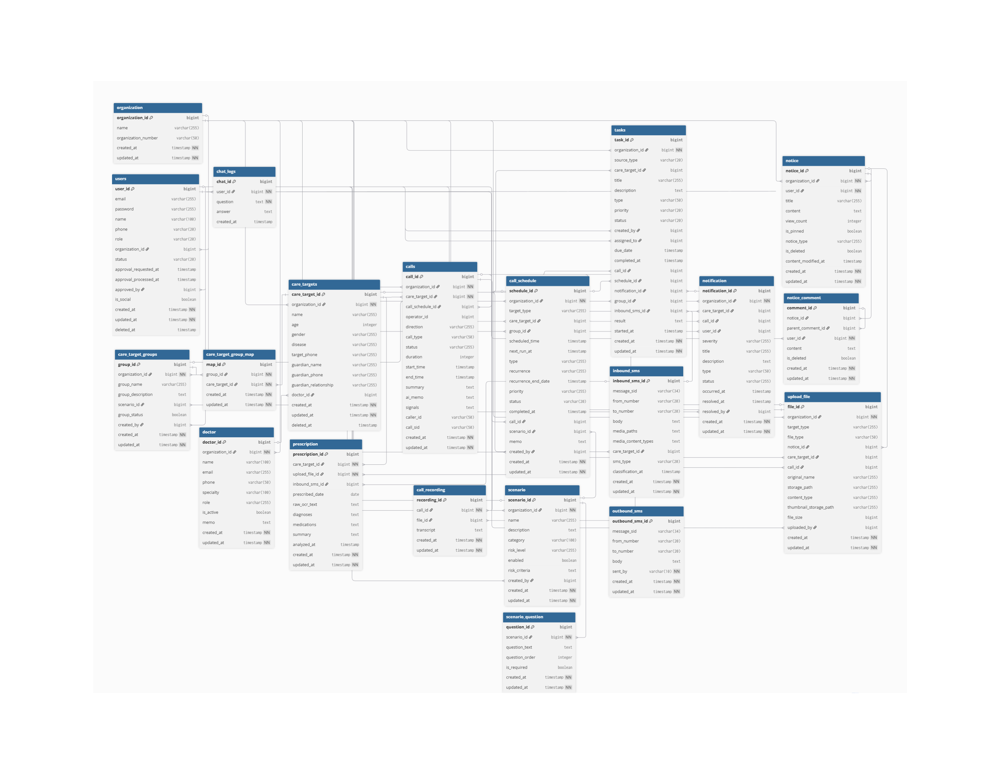

### 🔹유스케이스 다이어그램

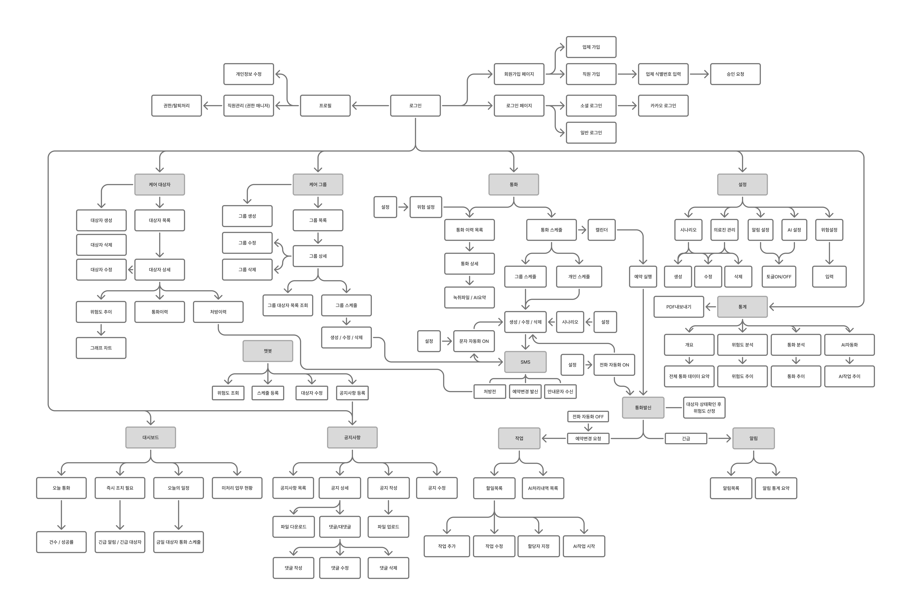

## 📂기능 소개

#### 시연영상 보러가기
[](https://youtu.be/5eAaIeB0pl8)

### 🔹 로그인 및 회원가입 (소셜 로그인)
 
 JWT 보안 인증 및 카카오 소셜 로그인을 통해 간편하고 안전한 접속 환경을 제공합니다.
 

- JWT를 이용한 보안 처리 및 Spring Security 활용
- 카카오 소셜 로그인
- httpOnly 쿠키 기반 토큰 관리

```java
// 카카오 소셜 로그인 처리
public OAuth2LoginResponseDTO processKakaoLogin(String email, String name) {
    User user = userRepository.findByEmail(email).orElse(null);
    if (user != null) return authService.generateTokens(user); // 기존 회원 로그인
    return OAuth2LoginResponseDTO.requiresAdditionalInfo(email, name); // 신규 회원 가입 필요
}
```
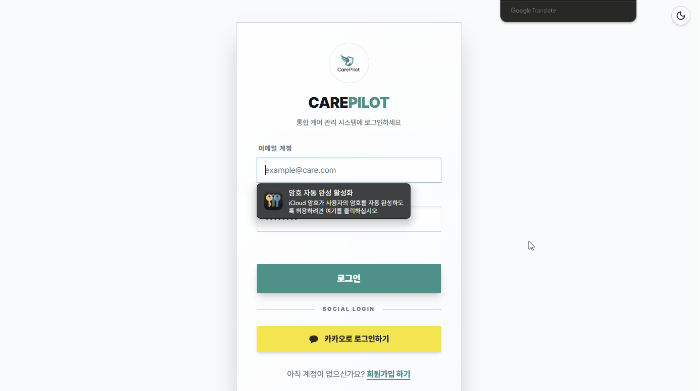

---

### 🔹 직원 관리
 
 조직 내 구성원의 가입 승인 및 권한 등급(Admin, Manager, User)을 체계적으로 관리합니다.
 

- 가입 승인 및 권한 관리
- 역할 기반 접근 제어 (ADMIN, MANAGER, USER)
- 조직별 사용자 관리
- 승인 대기 사용자 관리 및 이메일 알림

---

### 🔹 대시보드
 
 실시간 알림, 통화 스케줄, 업무 현황을 한눈에 파악할 수 있는 통합 관제 센터를 제공합니다.
 

- 오늘의 일정 - 오늘 날짜의 통화 스케줄 조회 및 상태 표시
- 즉시 조치 필요한 알림 - 긴급 알림(CRITICAL, HIGH) 및 위험도 높은 대상자 표시
- 미처리 업무 현황 - 대기 중인 작업 및 진행 중인 작업 통계
- 통화 통계 - 통화 완료율, 실패율 등 시각화
- 위험도 통계 - 조직 내 대상자 위험도 분포
- 최근 활동 - 최근 알림 및 작업 내역

```java
// 대시보드 통계 API
@GetMapping("/{orgId}/stats")
public ResponseEntity<Map<String, Object>> getDashboardStats(@PathVariable Long orgId) {
    return ResponseEntity.ok(Map.of(
        "callStats", dashboardService.getCallStats(orgId),
        "riskStats", dashboardService.getRiskStats(orgId),
        "taskStats", dashboardService.getTaskStats(orgId)
    ));
}
```

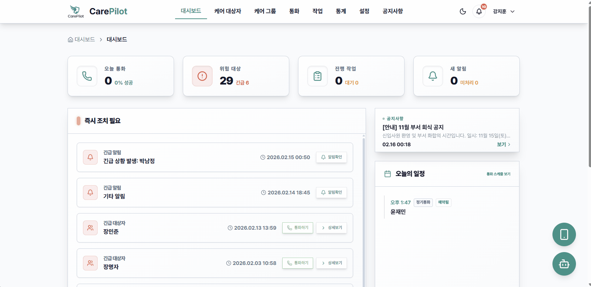

---

### 🔹 통계
 
 축적된 케어 데이터를 바탕으로 위험도 추이 및 자동화 성과를 시각적으로 분석한 리포트를 제공합니다.
 

- **대상자 및 그룹별 상세 리포트 제공**
- **위험도 분석** - 전체/그룹별 위험도 분포 및 추이 시각화
- **통화 분석** - 통화 성공률, 응답 시간 등 통화 품질 지표 확인
- **AI 자동화** - AI가 수행한 자동 조치 비율 및 성과 분석
- **PDF 내보내기** - 보고서 PDF 다운로드 기능

```java
// 통계 데이터 조회 (기간, 그룹, 질환 필터링)
public Map<String, Object> getStatistics(String start, String end, Long groupId, String disease) {
    return Map.of(
        "summary", reportService.getSummary(start, end, groupId, disease),
        "riskAnalysis", reportService.getRiskAnalysis(start, end, groupId, disease),
        "callAnalysis", reportService.getCallAnalysis(start, end, groupId, disease),
        "aiAutomation", reportService.getAiAutomationStats(start, end, groupId, disease)
    );
}
```
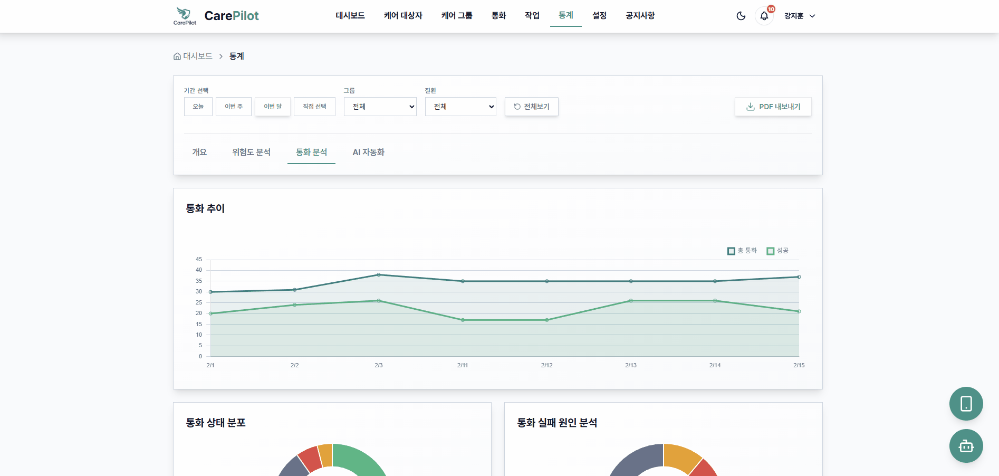
---

### 🔹 작업
 
 AI 자동화 설정이 꺼져 있을 때, 시스템이 감지한 중요 요청들을 '할일 목록'으로 자동 분류하여 실무자가 하나도 놓치지 않고 수동으로 처리할 수 있는 대기 보드 역할을 합니다.
 

- **유연한 업무 처리 (Automation-to-Manual)**
  - **수동 승인 대기열** - 자동화 모드가 꺼진 경우, AI가 감지한 예약 변경이나 챗봇 요청이 할일 목록에 쌓이며 '시작' 버튼 클릭 시 즉시 시스템에 반영됩니다.
  - **업무 가시성 확보** - 현재 대기 중인 작업과 처리 중인 업무를 실시간으로 구분하여 팀 내 업무 분담과 진행 상황을 명확히 알 수 있습니다.
- **통합 이력 관리** - AI가 조치한 자동 기록과 사용자가 직접 완료한 수동 처리 건을 모두 기록하여 작업의 투명성을 보장합니다.

```java
// AI 챗봇 자동화 작업 분류 및 처리
private void processChatbotAutomation(Long taskId) {
    Task task = taskRepository.findById(taskId).orElseThrow();
    if (task.getType() == TaskType.SCHEDULE_CHANGE) {
        scheduleService.updateReservation(task.getData()); // 예약 변경 자동 처리
    } else if (task.getType() == TaskType.NOTICE_CREATE) {
        noticeService.createNotice(task.getData()); // 공지사항 등록
    }
}
```

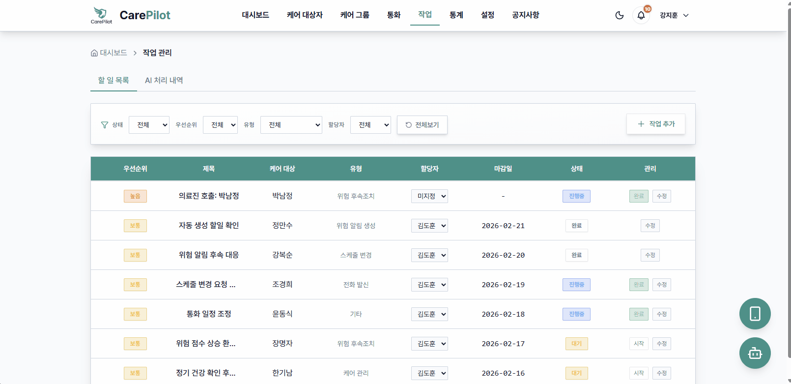

---

### 🔹 알림
 
 긴급 상황이나 주요 이벤트 발생 시 웹소켓을 통해 즉각적인 실시간 푸시 알림을 제공합니다.
 

- **실시간 WebSocket 알림** - STOMP 프로토콜 기반의 WebSocket을 통해 서버에서 발생한 긴급 상황 및 이벤트를 프론트엔드로 즉시 Push합니다.
- **조직별 브로드캐스트** - 보안과 효율성을 위해 조직(Organization) 단위의 전용 토픽(/topic/org/{orgId})으로 실시간 알림을 격리 송출합니다.
- **알림 심각도 및 상태 관리** - CRITICAL, HIGH, MEDIUM, LOW 심각도 분류와 읽음/미읽음 상태를 관리합니다.

```java
// WebSocket 실시간 알림 전송 로직
public void sendRealTimeNotification(Long orgId, Map<String, Object> message) {
    String topic = "/topic/org/" + orgId;
    messagingTemplate.convertAndSend(topic, message);
    log.info("WebSocket 실시간 알림 전송 완료: topic={}", topic);
}
```

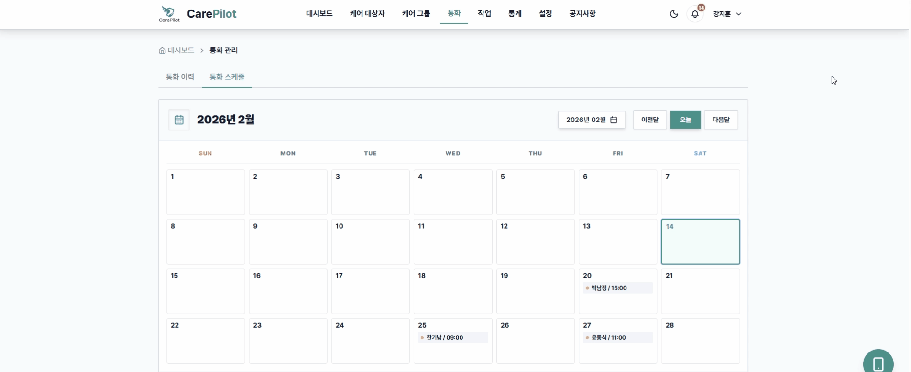
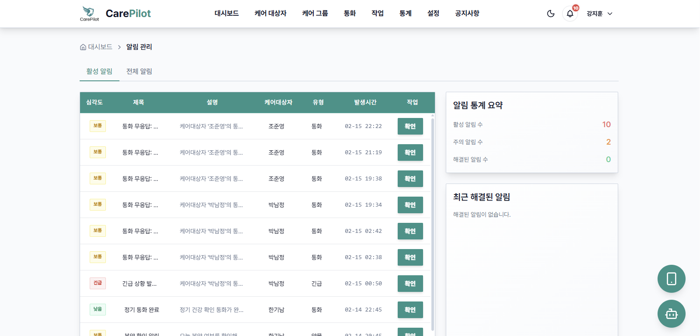

---

### 🔹 AI 챗봇
 
 자연어 대화를 통해 대상자 정보를 조회하거나 예약을 등록하는 등 지능형 가상 비서 기능을 제공합니다.
 

- **대상자 정보 조회 및 관리 (Function Calling)** - Spring AI의 Function Calling 기능을 통해 LLM이 직접 DB를 조회하거나 수정하여 대상자 정보 조회 및 예약 등록을 수행합니다.
- **RAG 기반 지식 검색** - RedisStack 벡터 데이터베이스와 BGE-M3 임베딩 모델을 활용한 RAG(Retrieval-Augmented Generation) 시스템으로 정확한 맥락 파악 및 답변을 제공합니다.
- **하이브리드 LLM 지원** - 성능 중심의 OpenAI GPT-4o와 데이터 보안 중심의 Local LLM(Ollama Qwen2.5)을 실시간으로 스위칭하여 사용 가능합니다.
- **멀티턴 대화 (Chat Memory)** - ChatMemory 시스템을 통해 이전 대화 맥락을 유지하며 매끄러운 소통을 지원합니다.

```java
// RAG 기반 AI 챗봇 응답 생성
public String generateAiResponse(String userMessage) {
    List<Document> context = vectorSearchService.search(userMessage); // RAG 검색
    return chatClient.prompt()
        .system(systemPrompt)
        .user(userMessage)
        .call().content(); // LLM 응답 생성
}
```

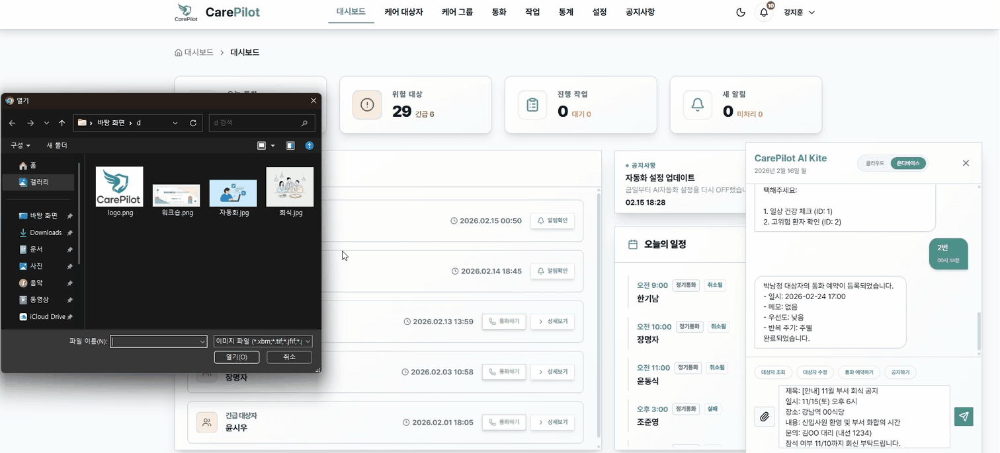

---
## 🔹 케어 대상자 관리

조직별 맞춤형 케어 대상자 관리와 CSV 기반 일괄 데이터 처리 기능을 제공

- CSV/EXCEL 업로드로 대상자 대량 등록

```java
// CSV 대량 등록 처리
public void uploadCareTargets(MultipartFile file) {
    List<CareTargetDTO> targets = csvParser.parse(file, CareTargetDTO.class);
    careTargetRepository.saveAll(targets.stream().map(DTO::toEntity).toList());
}
```

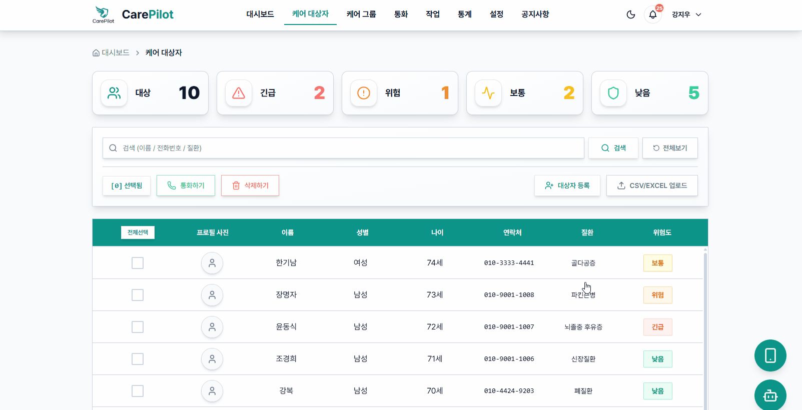

### 대상자 상세보기

- 대상자 프로필 등록(대상자 수정)
- 위험도 추이 - 통화 후 LLM이 대상자의 위험도 스코어를 제공하며, 해당 데이터를 기반으로 주별로 시각화하여 제공
- 통화 이력
- 처방 이력

```java
// 프로필 이미지 업로드
public void updateProfileImage(Long targetId, MultipartFile file) {
    String imageUrl = s3Service.upload(file);
    careTargetRepository.findById(targetId).ifPresent(t -> t.updateImage(imageUrl));
}
```

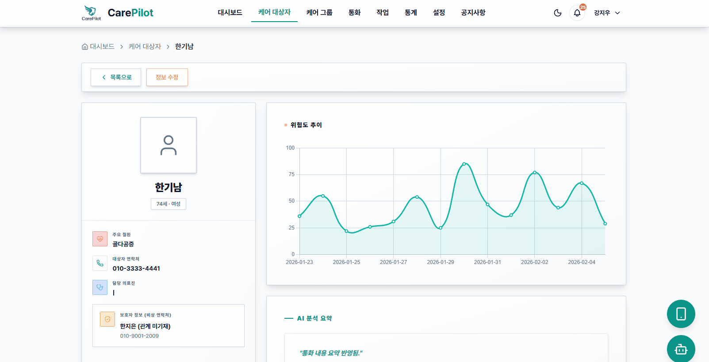

## 🔹 케어 그룹

유사성이 같은 대상자들을 그룹별로 관리하여 모니터링할 수 있는 기능을 제공합니다.

- 그룹 생성 및 관리
- 그룹별 통화 스케줄 관리

```java
// 케어 그룹 생성
public void createGroup(GroupDTO dto) {
    careGroupRepository.save(CareGroup.builder()
        .name(dto.getName())
        .description(dto.getDescription())
        .build());
}
```

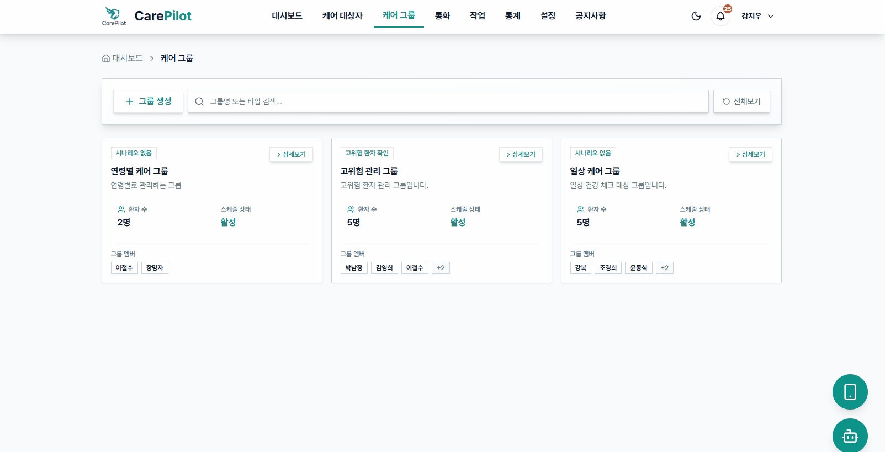

## 🔹 공지사항
 
 조직 내 원활한 소통을 위해 파일 첨부 및 계층형 댓글 기능을 지원하는 게시판을 제공합니다.
 

- 공지 등록 및 댓글 작성
- 대댓글 기능
- 이미지 업로드 및 파일 관리

```java
// 공지사항 등록 및 파일 첨부
public void createNotice(NoticeDTO dto, List<MultipartFile> files) {
    Notice notice = noticeRepository.save(dto.toEntity());
    if (files != null) fileService.uploadFiles(notice.getId(), files);
}
```

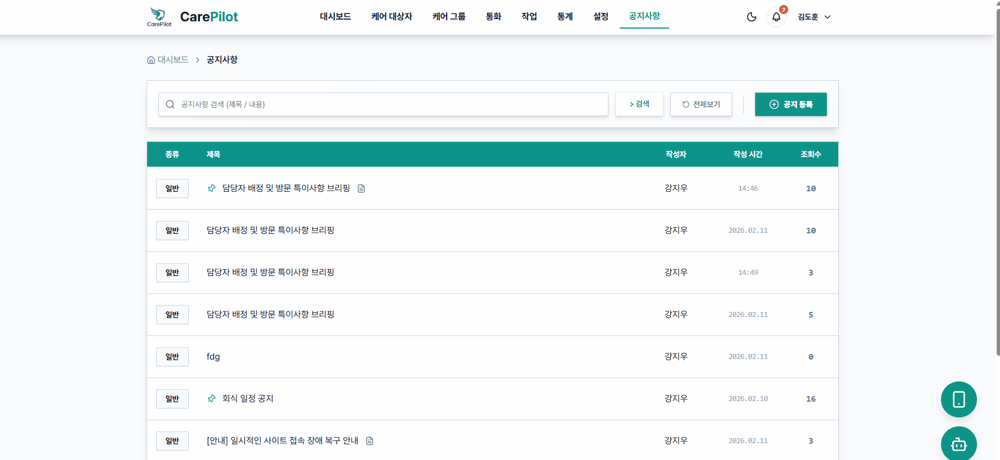
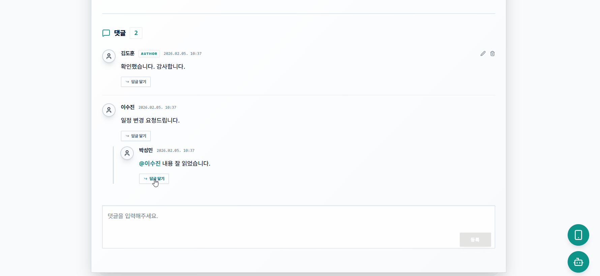

## 🔹 설정
 
 통화 시나리오 설계, 위험 임계값 및 AI 자동화 여부 등 시스템 운영 전반을 관리할 수 있는 환경을 제공합니다.
 

- **시나리오 관리(CRUD)** - 통화 연결 시 대상자에게 전달될 질문지 관리
- **위험 설정** - LLM이 산출한 위험 점수가 미리 설정한 임계값(Threshold)을 초과할 경우, 해당 등급(긴급, 위험, 보통, 낮음)으로 자동 분류
- **알림 설정 ON/OFF**
  - SMS 알림 - 긴급 상황 시 SMS(문자)로 알림
  - 이메일 알림 - 직원 회원가입 요청 시 승인 이메일 발송
  - 위험 감지 - 케어 대상자 위험 감지 알림
  - 통화 실패 - 정기 통화 실패 시 알림
  - 긴급 상황 - 긴급 상황 시 즉시 알림 (통화 중 긴급 상황인 경우 실시간 긴급 알림)
- **AI 설정** - 챗봇 자동화, SMS/통화 자동화 설정
- **의료진 관리**

```java
// 시나리오 질문지 생성
public void createScenario(ScenarioDTO dto) {
    scenarioRepository.save(dto.toEntity());
}

// 위험도 임계값 설정
public void updateRiskConfig(RiskConfigDTO dto) {
    riskConfigService.updateThresholds(dto);
}
```

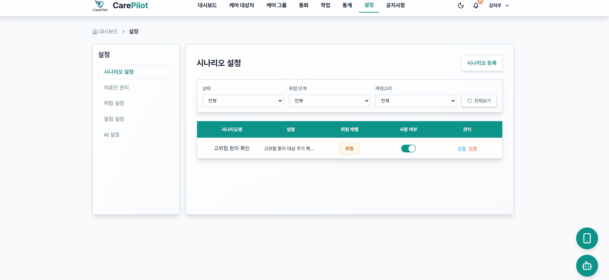

## 🔹 통화
 
 개인 및 그룹별 통화 스케줄을 예약·관리하고, Twilio와 AI를 연동하여 예약된 시간에 자동으로 전화를 걸어 대상자의 건강 상태를 확인하며 모든 통화 이력을 체계적으로 관리합니다.
 

- **통화 스케줄** - 개인/그룹 스케줄 등록 (일회성/반복 예약 지원)
- **통화 이력** - 통화 전문, AI 요약, 녹취 파일
- **자동 통화 실행 (Twilio + STT)** - Twilio Programmable Voice와 STT(Speech-to-Text)를 연동하여 대상자의 음성 응답을 실시간 텍스트로 변환합니다.
- **실시간 긴급 상태 감지 (GPT-4o)** - 통화 중 "살려달라", "너무 아프다"와 같은 위급 키워드 및 맥락을 GPT-4o가 실시간 분석하여 의료진에게 긴급 알림을 즉시 전송합니다.
- **위험도 스코어링 및 요약** - 통화 종료 후 전체 대화 내용을 요약하고, 대상자의 현재 위험도를 점수화하여 주별 추이 그래프로 시각화합니다.
- **페르소나 기반 대화** - 각 대상자의 특성에 맞춘 개인화 프롬프트 엔지니어링을 통해 자연스러운 상호작용을 제공합니다.

**자동화 프로세스**
- 스케줄 기반 자동 통화 실행 → 시나리오 질문 자동 진행 → STT 음성 인식으로 응답 수집
- 실시간 긴급 상태 감지 (LLM 기반) → 위험도 산정 및 알림 생성

```java
// 통화 스케줄 등록
public void createSchedule(ScheduleDTO dto) {
    scheduleRepository.save(dto.toEntity());
}

// 통화 중 실시간 긴급상황 감지
public boolean detectEmergency(String response) {
    return aiClient.analyzeRisk(response).isEmergency();
}
```

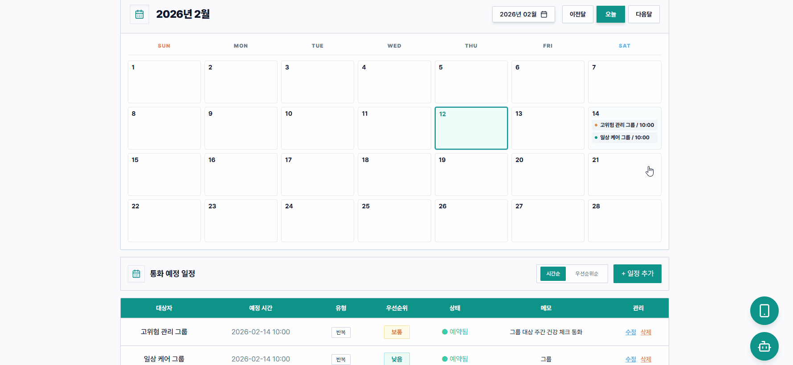

## 🔹 SMS
 
 Twilio API와 AI를 결합하여 예약 안내부터 변경 요청 처리, 처방전 사진 수신까지 대상자와의 소통 창구를 하나로 통합하여 관리 효율을 높입니다.
 
- **자동 예약 알림 및 안내** - 예정된 통화 일정을 대상자에게 문자로 자동 안내하여 참여율을 높이고, 신뢰할 수 있는 소통 채널을 유지합니다.
- **간편한 예약 변경** - 대상자가 보낸 문자의 의도를 분석하여 복잡한 조작 없이도 통화 스케줄을 손쉽게 변경하거나 할일 목록에 등록할 수 있습니다.
- **디지털 처방전 수집** - 대상자가 MMS로 보낸 처방전 이미지를 AI Vision이 분석하여 약물 정보와 진단명을 자동으로 기록하므로 수기 입력의 번거로움이 사라집니다.
- **실시간 양방향 채팅** - 대시보드 내 대화창에서 실시간으로 문자를 주고받으며, 번호 매칭을 통해 누구와 대화하는지 즉시 확인하고 대응할 수 있습니다.

```java
// SMS 발송 처리
@PostMapping("/send-sms")
public ResponseEntity<SendSmsResponseDTO> sendSms(@RequestBody SendSmsRequestDTO request) {
    String parsedPhoneNumber = PhoneNumberUtil.parsePhoneNumber(request.getTo());
    String messageSid = twilioService.sendSms(parsedPhoneNumber, request.getMessage());
    
    OutboundSms outbound = OutboundSms.builder()
            .messageSid(messageSid)
            .fromNumber(twilioService.getFromNumber())
            .toNumber(parsedPhoneNumber)
            .body(request.getMessage())
            .sentBy(SentBy.USER)
            .build();
    outboundSmsRepository.save(outbound);
    return ResponseEntity.ok(SendSmsResponseDTO.builder()
            .message("문자 발송이 완료되었습니다.")
            .messageSid(messageSid)
            .build());
}
```
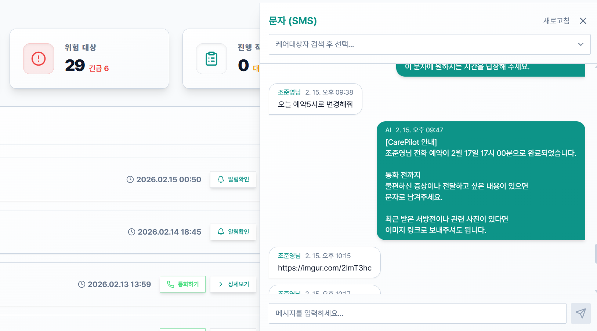

## 🔹 반응형 UI
 
 다양한 디바이스(PC, 태블릿, 모바일) 환경에서 최적화된 사용자 경험을 제공하기 위한 반응형 레이아웃을 지원합니다.
 

- PC / 태블릿 / 모바일 지원
- 브레이크포인트별 레이아웃 최적화

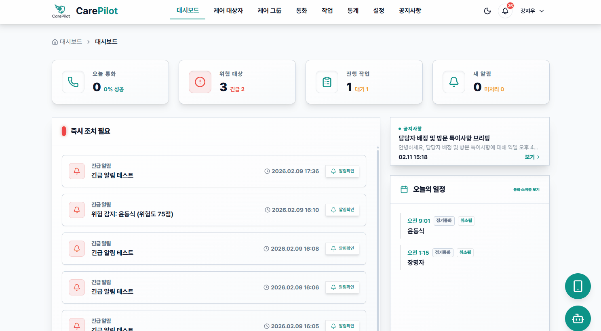


## 🔹 화면 모드
 
 사용자의 시력 보호와 가독성 향상을 위해 다크 모드와 라이트 모드 테마를 모두 지원합니다.
 
- 다크모드 / 라이트모드 지원

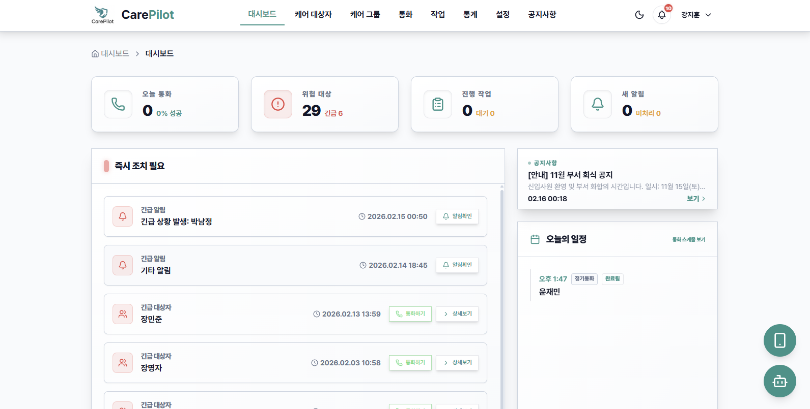
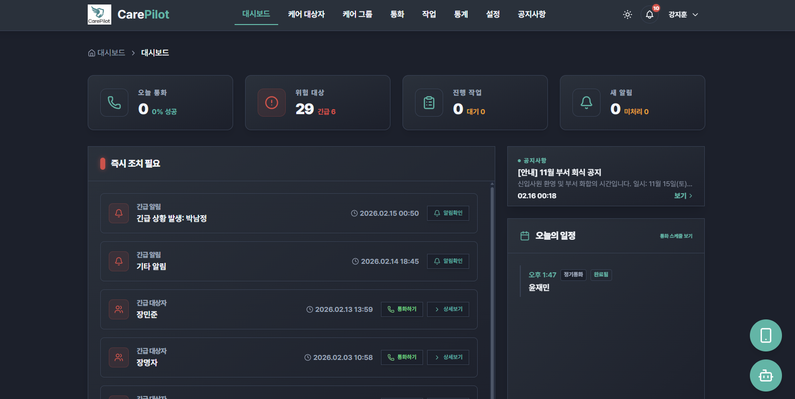

